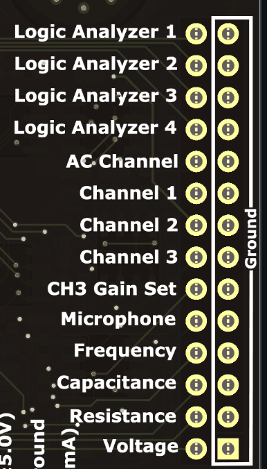
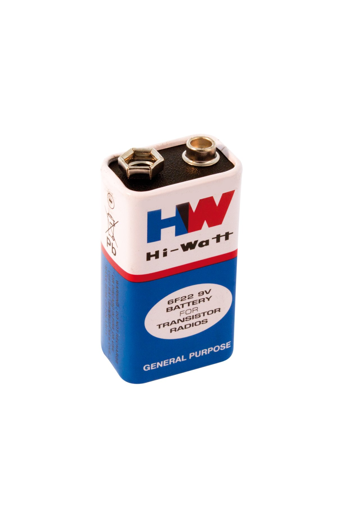
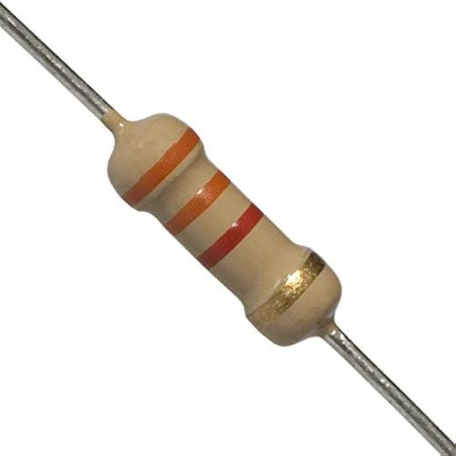
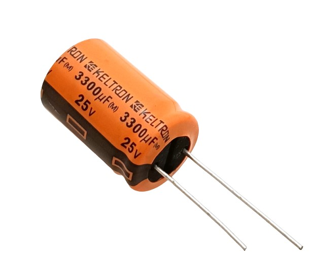

# Multimeter

## What's a Multimeter
A multimeter is an electronic tool used to measure various electrical properties such as voltage, current, resistance, capacitance and frequency.
It is used for measuring the values of voltage and current at various points in a circuit that can be used for analysis of the electrical circuits and help in troubleshooting.

## How to use it

  

* Open the _PSLab_ app

* Navigate to the multimeter option on the _PSLab_ app home screen

* Select the required measurements type needed :
    * Voltage
    * Frequency
    * Clock Pulses
    * Resistance
    * Capacitance

* For measuring voltage we use:
    * CH 1
    * CH 2
    * CH 3
    * VOL
    * CAP(Capacitive pin voltage measurement)

  

* For measuring the frequency(Upto 4 MHz) or clock pulses:
    * Logic Analyser 1
    * Logic Analyser 2
    * Logic Analyser 3
    * Logic Analyser 4

* For measuring capacitance:
    * -| (- (pF to uF range)

* For measuring resistance:
    * Ω

### Important Features
* Multimeter Configuration:
    * <strong>Update period</strong> can be selected 
    * <strong>Location data</strong> can be included in the logged files

* Logged data:
    * It stores the logs of the data collected by the multimeter

## Experiment: Measuring Resistance with _PSLab_

  

### Goal
To measure voltage of a battery using _PSLab_

### Materials Required

- Android Phone
- [_PSLab_](https://play.google.com/store/apps/details?id=io.pslab\&hl=en_US)[ Android App](https://play.google.com/store/apps/details?id=io.pslab\&hl=en_US)
- Battery(9V)

### Procedure

  

1. Open the _PSLab_ Android app.
2. Select the **Multimeter** option.
3. The app will display various Multimeter options:
   - **Voltage**
   - **Hz**
   - **Count Pulse**
   - **Measure**

4. Choose **VOl** in **Voltage** .
5. Connect the voltage and ground terminals of the battery to VOL and ground repectively using connecting wires.
6. **The Voltage is displayed** and stored in the logs

### Observations

- The value of Multimeter starts increasing as the battery is connected.
- The _PSLab_ successfully measures the battery.

### Conclusion

The _PSLab_ measures the battery voltage.

## Experiment: Measuring Voltage (check your battery) with _PSLab_

  

### Goal
To measure resistance of a resistor using _PSLab_

### Materials Required

- Android Phone
- [_PSLab_](https://play.google.com/store/apps/details?id=io.pslab\&hl=en_US)[ Android App](https://play.google.com/store/apps/details?id=io.pslab\&hl=en_US)
- Resistor(220 Ω)

### Procedure

  

1. Open the _PSLab_ Android app.
2. Select the **Multimeter** option.
3. The app will display various Multimeter options:
   - **Voltage**
   - **Hz**
   - **Count Pulse**
   - **Measure**

4. Choose **Ω** in **Measure** .
5. Connect the end terminals of the resistor to resistance and ground repectively using connecting wires.
6. **The Resistance is displayed** and stored in the logs

### Observations

- The value of resistor is displayed in the multimeter.
- The _PSLab_ successfully measures the resistor.

### Conclusion

The _PSLab_ measures the resistance of the resistor.

## Experiment: Measuring Capacitance with _PSLab_

  

### Goal
To measure capacitance using _PSLab_

### Materials Required

- Android Phone
- [_PSLab_](https://play.google.com/store/apps/details?id=io.pslab\&hl=en_US)[ Android App](https://play.google.com/store/apps/details?id=io.pslab\&hl=en_US)
- Capacitor(110 pf)

### Procedure

  

1. Open the _PSLab_ Android app.
2. Select the **Multimeter** option.
3. The app will display various Multimeter options:
   - **Voltage**
   - **Hz**
   - **Count Pulse**
   - **Measure**

4. Choose **-| (-** in **Measure** .
5. Connect the voltage and ground terminals of the capacitor to Capacitance and ground repectively using connecting wires.
6. **The Capacitance is displayed** and stored in the logs

### Observations

- The value of capacitor is displayed in the multimeter.
- The _PSLab_ successfully measures the capacitor.

### Conclusion

The _PSLab_ measures the capacitance of the capacitor.

## Experiment: Measuring Frequency with _PSLab_

  

### Goal
To measure freqeuncy using _PSLab_

### Materials Required

- Android Phone
- [_PSLab_](https://play.google.com/store/apps/details?id=io.pslab\&hl=en_US)[ Android App](https://play.google.com/store/apps/details?id=io.pslab\&hl=en_US)
- 555 timer board(6.86Hz)

### Procedure

  

1. Open the _PSLab_ Android app.
2. Select the **Multimeter** option.
3. The app will display various Multimeter options:
   - **Voltage**
   - **Hz**
   - **Count Pulse**
   - **Measure**

4. Choose **LA1** in **Hz** .
5. Connect the voltage and ground terminals of the 555 timer board to Logic Analyser 1 and ground repectively using connecting wires.
6. **The Frequency is displayed** and stored in the logs

### Observations

- The value of frequency is displayed in the multimeter.
- The _PSLab_ successfully measures the frequency.

### Conclusion

The _PSLab_ measures the frequency of the 555 timer board.
